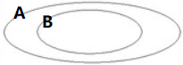
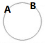
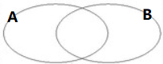
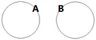

# Conditional Statements

## Venn

-   restrictions
    -   those diagrams only care about `A` and `B` and `A - B` and `B - A`, no `C` or anything else.
-   venn attributes
    -   each dot in venn graph is an event.
    -   the space of the venn is sample space.
    -   events in the same diagram (sample space) are mutually dependent.
    -   events in different diagrams (sample spaces) are mutually independent.
    -   each diagram (sample space) can be treated as a layer.
        -   each layer can be placed on top of other layers.
            -   when a needle point through all layers, those dots (events) are happened and mutually independent.
-   cases
    -   
        -   `B` always `A`.
        -   `B` -> `A`.
        -   if `B` then `A`.
        -   `A` is necessary to `B`.
            -   `B` will always leads to `A`.
            -   `B` can fall nowhere but in `A`.
        -   `B` is sufficient to `A`.
            -   if a dot (event) in `B`, the dot (event) is also in `A`.
            -   why not `B` is not necessary?
                -   there are some space that `B` cannot explain `A`.
        -   `B`, only if `A`.
            -   `B`, 除非 `A`.
            -   one only `B` if `A`. (Not so sure)
                -   if not `A`, not `B`.
                -   "only" indicates `A`?
            -   `B`, only when `A`.
            -   what is indicated by "only"/"must" is the necessary condition
        -   `A` sometimes/may `B`.
        -   To `A`, one can `B`.
        -   To `B`, one sometimes/may `A`.
    -   
        -   `A` <-> `B`.
        -   To `A`, one must/only `B`.
        -   To `B`, one must/only `A`.
        -   if and only if `A` then `B`.
    -   
        -   `A` sometimes/may `B`.
        -   `B` sometimes/may `A`.
        -   To `A`, one sometimes/may `B`.
        -   To `B`, one sometimes/may `A`.
    -   
        -   `A` never `B`.
        -   `B` never `A`.

## References

-   <https://www.khanacademy.org/test-prep/lsat/lsat-lessons/logic-toolbox-new/a/logic-toolbox--article--conditional-reasoning-logical-equivalence>
